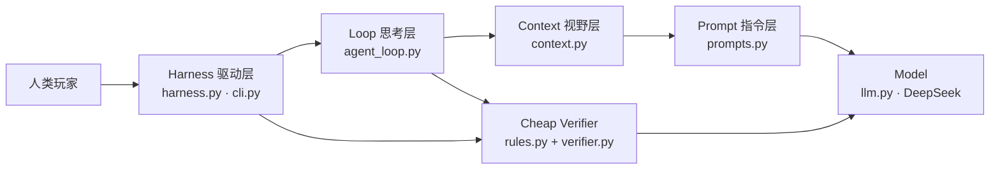
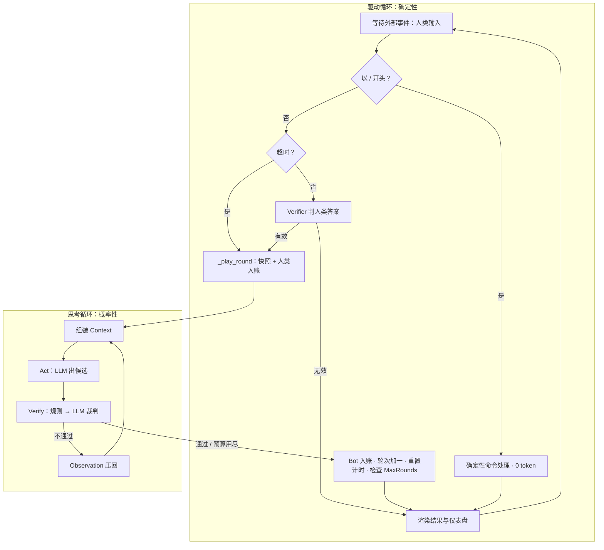
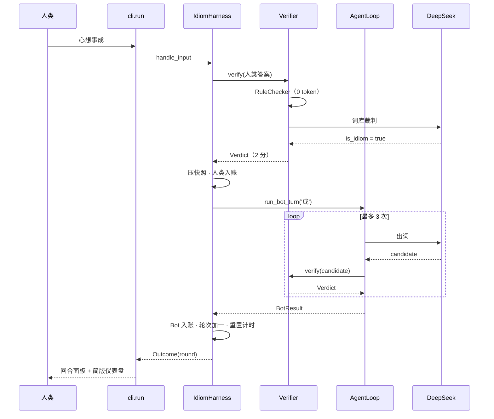

## 摘要

大语言模型本身只是一个把输入 Token 映射为输出 Token 的纯函数。要把它变成行为稳定、可测试、可计费的 Agent，需要在它外面依次包上四层工程：Prompt Engineering、Context Engineering、Loop Engineering 与 Harness Engineering，即

```text
AI Agent = Harness( Loop( Context( Prompt, Model ) ) )
```

本文以一个约 1,200 行 Python 实现的「成语接龙·人机对抗」终端游戏（Idiom Solitaire Mini Harness，模型为 DeepSeek）为样本，逐层说明每种工程实践在代码中的具体落点。本文的重点是区分两种常被混为一谈的循环：Loop Engineering 中的**思考循环**（Agent Loop，概率性，由模型输出与验证结果驱动，受重试预算约束），以及 Harness Engineering 中的**驱动循环**（Agent Harness，确定性，由外部事件驱动，受游戏规则约束）。我们从触发源、状态归属、终止条件、失败处理、副作用、成本与可测试性等十个维度对比两者，并用代码证明二者之间只有一个很窄的边界契约：思考循环只读上下文、只返回结果，所有写入记录系统的操作都由驱动循环完成。最后给出这套分层带来的工程收益：96 个离线测试不联网即可覆盖全部控制流；斜杠命令 0 token；一次真实对局 6 次模型调用约 1,350 tokens。

**关键词**：Agentic AI；Harness Engineering；Loop Engineering；Context Engineering；Prompt Engineering；Cheap Verifier；确定性外壳

## 1 引言

把 LLM 接进一个产品时，最常见的失败方式并不是模型“不够聪明”，而是工程边界不清：本该由代码保证的规则交给了模型，本该在模型内部消化的错误漏到了外部状态，本该只存在于一次推理中的临时信息污染了长期记录。成语接龙是暴露这些问题的一个好场景：

- 规则有一半是**形式的**（首字是否接上、是否谐音、是否重复），用代码就能 100% 判定；
- 另一半是**知识的**（这四个字是不是成语），只能交给模型，而模型会出错；
- 它有明确的外部状态（比分、轮次、接龙链）、明确的时间约束（倒计时）和明确的终止条件（总轮数）。

本文的贡献有三点：

1. 给出四层工程在一个完整可运行系统中的**代码级映射**，每一层都有对应的文件、接口与测试；
2. 从十个维度界定**思考循环**与**驱动循环**的差异，并指出它们之间的边界契约；
3. 用 TDD 过程与真实调用数据说明，这种分层让概率性部分被压缩到最小、确定性部分可以完全离线验证。

## 2 系统概览

### 2.1 游戏规则

人类与 Bot 轮流接龙，每一轮由“人类一步 + Bot 一步”组成。原字接龙得 2 分，谐音接龙得 1 分（是否允许取决于难度模式），再乘以模式倍率；成语至少 4 个字，本局不可重复。人类可以用斜杠命令求助（`/hint`，本轮 0 分）、跳过（`/pass`，扣 1 分）、悔棋（`/undo`）等。每轮有倒计时，超时按跳过处理。四档难度的差异体现在倍率、谐音许可与词库严格度上：

| 模式 | 人类：倍率 / 谐音 / 词库 | Bot：倍率 / 谐音 / 词库 |
| :-- | :-- | :-- |
| easy | ×2 / 允许 / 宽松 | ×1 / 不允许 / 严格 |
| normal | ×1 / 允许 / 宽松 | ×1 / 不允许 / 严格 |
| hard | ×1 / 不允许 / 宽松 | ×1 / 不允许 / 严格 |
| extreme | ×1 / 不允许 / 严格 | ×1 / 不允许 / 严格 |

### 2.2 分层结构



各层与源文件的对应关系如下（行数含注释）：

| 层 | 源文件 | 行数 | 职责 |
| :------ | :-------- | ---: | :---------------------------- |
| Model | `llm.py` | 99 | `LLMClient` 协议；`DeepSeekClient`（OpenAI 兼容协议 + JSON Output）；用量统计 |
| Prompt | `prompts.py` | 63 | 三个纯函数：词库裁判、Bot 出词、提示教练 |
| Context | `context.py` | 57 | 完整历史链；最近 N 个成语的压缩视野；本回合 Observation 拼装 |
| Loop | `agent_loop.py` | 85 | Act → Verify → Observe → Retry；重试预算 |
| 验证器 | `rules.py` + `verifier.py` | 120 | 两级 Cheap Verifier：确定性规则 → LLM 词库裁判 |
| Harness | `harness.py` | 319 | 模式矩阵、斜杠命令、计分账本、快照、倒计时、终止条件 |
| 界面 | `cli.py` + `cli_input.py` + `ui.py` | 443 | 驱动循环主体、命令补全、Rich 仪表盘 |

组装发生在一个函数里，依赖方向一目了然（`harness.py:315`）：

```python
def build_harness(llm: LLMClient, max_history_turns: int = 10, **kwargs) -> IdiomHarness:
    """组装四层：Harness( Loop( Context( Prompt, Model ) ) )。"""
    context = ContextManager(max_history_turns=max_history_turns)
    loop = AgentLoop(llm, context, Verifier(llm))
    return IdiomHarness(loop, **kwargs)
```

所有外部依赖（模型、时钟）都通过构造参数注入。这是后文“两种循环可以分别测试”的前提。

## 3 四层工程实践

### 3.1 Prompt Engineering：单步指令的清晰表达

Prompt 层只解决一件事：一次调用里，角色、任务、约束和输出格式是否表达清楚。`prompts.py` 中的三个函数都是纯函数，输入参数、输出 `messages`，不读任何全局状态：

| 函数 | 角色 | 输出 JSON |
| :-- | :-- | :-- |
| `build_verifier_messages` | 成语裁判 | `{"is_idiom": bool, "reason": str}` |
| `build_bot_system_prompt` | 接龙高手 | `{"candidate": str, "reasoning": str}` |
| `build_hint_messages` | 接龙教练 | `{"candidates": [str, ...]}` |

两处设计值得注意。

**第一，裁判 Prompt 的职责被刻意收窄。** 讨论稿中，裁判需要同时判断“首字/谐音是否匹配”与“是否在词库中”，并直接给出 2/1/0 分。本实现把前者全部移到 `rules.py`，裁判只回答“这是不是该词库认可的成语”。Prompt 越窄，模型越不容易出错，而形式规则交给代码后，计分就成了确定的。

**第二，Prompt 的迭代以真实调用为证据。** 初版 strict 词库的定义是“只接受《现代汉语词典》《成语大词典》等标准词典收录的成语”。live 测试中，DeepSeek 以“《现代汉语词典》未收录为成语，属常用四字祝福语”为由判定「心想事成」无效。这个定义把“成语”错误地绑定到一部并非成语词典的辞书上。修订后的定义改为“被任一权威成语词典收录，或被普遍当作成语使用的固定语”，并明确点名祝福类成语。修订后抽测 10 个样本：

| 候选 | 词库 | 判定 | 模型给出的理由（摘录） |
| :-------- | :---- | :--- | :-------------------- |
| 心想事成 | strict | 是 | 常见祝福类成语，被普遍当作成语使用 |
| 一马当先 | strict | 是 | 出自《水浒传》 |
| 画蛇添足 | strict | 是 | 出自《战国策》 |
| 心猫跑桌 | strict | 否 | 自造词 |
| 吃饭睡觉 | strict | 否 | 普通词组 |
| 吃饭睡觉 | lax | 否 | 日常口语短语，属随意拼凑 |
| 说曹操曹操就到 | lax | 是 | 广为流传的俗语 |
| 好好学习 | strict | 否 | 口号式短语 |
| 天天向上 | lax | 是 | 广为流传的励志熟语 |
| 新官上任 | strict | 否 | 俗语短语，非成语 |

这个例子说明，Prompt Engineering 的产出应当和测试一起演进：一条 live 测试失败，驱动了一次有据可查的 Prompt 修订。

### 3.2 Context Engineering：模型视野与记录系统的分离

Context 层管理的是“模型在推理那一刻能看到什么”。`ContextManager`（`context.py:21`）同时维护两种视图：

| 视图 | 来源 | 用途 | 是否进 Prompt |
| :-- | :-- | :-- | :-- |
| `history` | 全部接龙记录 | `/undo` 回滚、详版面板 | 否 |
| `used_idioms` | 由完整 `history` 推导 | 确定性判重 | 否 |
| `recent_chain()` | 最近 `max_history_turns` 个（默认 10） | 给 Bot 看的接龙链 | 是 |
| `observations` | 本回合的自检报错 | 驱动重试 | 是，但只在本回合有效 |

这里的关键是“压缩只作用于视野，不作用于规则”。给模型看的是最近 10 个成语（Compaction，抑制上下文腐烂、节省 token）；判重用的却是完整历史。如果 Bot 说出一个 20 轮前用过、已经不在视野里的成语，规则层照样会拦下，并把“本局已经用过了”作为 Observation 送回模型。压缩带来的信息损失，由确定性规则兜底。

`assemble_bot_messages`（`context.py:36`）把两类信息拼进同一条 user 消息：

```text
[当前接龙历史链条（最近 2 个）]: 心想事成 → 成竹在胸
[自检报错 1]: 候选词「一马当先」无效：首字「一」接不上「胸」
请换一个成语，修正以上问题。
[请给出你的接龙词]
```

`observations` 是 `run_bot_turn` 的局部变量，回合结束即丢弃，从不写入 `history`。失败尝试不会进入下一回合的 Prompt，因而不会形成长期噪声；但它们会完整保存在 `RoundRecord.bot.attempts` 中，供界面展示。**给模型看的**和**给人看的**，在这里被明确分开。

### 3.3 Loop Engineering：思考循环与 Cheap Verifier

Loop 层把“一次调用”变成“一个自我纠错的闭环”。核心代码只有二十余行（`agent_loop.py:41`）：

```python
def run_bot_turn(self, target_char, allow_homophone, dict_level, max_retries=3) -> BotResult:
    system_prompt = build_bot_system_prompt(target_char, allow_homophone, dict_level)
    observations: list[str] = []
    attempts: list[Attempt] = []

    for _ in range(max_retries):
        # A. 组装 Context（最近 N 轮 + 本回合所有自检报错）
        messages = self.context.assemble_bot_messages(system_prompt, observations)
        # B. Act：生成候选
        try:
            response = self.llm.complete_json(messages)
        except LLMError as e:
            attempts.append(Attempt("", False, f"模型调用失败：{e}"))
            continue
        candidate = normalize_idiom(str(response.get("candidate", "")))
        # C. Verify：与人类同一套裁判
        verdict = self.verifier.verify(
            target_char, candidate, allow_homophone, dict_level, used=self.context.used_idioms
        )
        attempts.append(Attempt(candidate, verdict.is_valid, verdict.reason))
        if verdict.is_valid:
            return BotResult("success", candidate, verdict.score, attempts)
        # D. Observe：把错误压回 Context，驱动下一次 Retry
        observations.append(f"候选词「{candidate}」无效：{verdict.reason}")

    return BotResult("failed", attempts=attempts)
```

**Cheap Verifier 原则**在这里有两层含义。

第一层是“放在循环内部”：候选成语在影响任何外部状态之前，就已经被校验过。外部看到的 Bot 只有两种结果：合规的成语，或者明确的放弃。

第二层是“廉价优先”：`Verifier.verify`（`verifier.py:30`）先调用 `RuleChecker`（0 token，微秒级），只有形式合规的候选才会花一次模型调用做词库裁判，裁判结果还按 `(成语, 词库)` 缓存。Bot 最常见的错误是首字接错或重复，这类错误根本不产生第二次模型调用：

| 候选状态 | 本次尝试的模型调用 |
| :-- | :-- |
| 首字接错 / 重复 / 长度不对 | 1 次（出词），规则层直接拒绝 |
| 形式合规、首次出现 | 2 次（出词 + 裁判） |
| 形式合规、裁判结果已缓存 | 1 次（出词） |

**显式终止条件**有两个：自检通过（`success`）或预算用尽（`failed`）。模型调用本身失败（网络、空内容、非法 JSON）也消耗一次预算。无论模型如何表现，循环都不会超过 `max_retries` 次迭代。

### 3.4 Harness Engineering：确定性外壳

Harness 层是包在模型外面的全部确定性软件。讨论稿列出了 Harness 的五大组件，它们在 `harness.py` 中的落点如下：

| 组件 | 落点 |
| :-- | :-- |
| 记录系统（System of Record） | `scores`、`round_log`、`_snapshots` 快照栈 |
| 工具集 | 10 个斜杠命令，统一经 `_process_slash_command` 分派 |
| 反馈闭环 | 用 `Verifier` 判人类答案；调用 `AgentLoop` 让 Bot 自检 |
| 护栏权限 | `MODE_CONFIGS` 模式矩阵、倒计时熔断、`max_rounds` 终止 |
| 可观测性 | `RoundRecord` 保留 Bot 每次尝试；`/status` 展示 LLM 调用与 token |

它遵循 **Hashimoto 原则**：用工程手段消除错误，让违规在代码层面就不可能发生，而不是在 Prompt 里恳求模型别犯错。具体体现在四处：

1. **命令拦截零 token。** 以 `/` 开头的输入在进入任何模型调用之前就被分派（`harness.py:170`），除 `/hint` 外，所有命令都不调用 LLM。测试 `test_commands_do_not_call_llm` 对 7 条命令逐一断言 `llm.calls == []`。
2. **计分完全由代码决定。** 基础分来自 `RuleChecker`（原字 2、谐音 1），倍率来自 `MODE_CONFIGS`，罚分是常量 `PASS_PENALTY = -1`。模型只有“是/否成语”这一票。
3. **悔棋按快照整轮回滚。** 每轮开始前压入一个 `_Snapshot`（比分、轮次、末字、历史长度、日志长度），`/undo` 原样恢复。讨论稿的伪代码只从上下文里弹出一条记录，比分和末字会与接龙链对不上账；这是把“模型视野”当成“记录系统”造成的缺陷。
4. **时间与终止条件可注入、可推导。** 时钟以 `clock: Callable[[], float]` 注入；`game_over` 是由 `current_round > max_rounds` 推导出的属性，而不是一个需要手动维护的布尔值。因此 `/rounds` 调大后已结束的对局会自动恢复，`/undo` 也能撤销最后一轮。

## 4 核心辨析：思考循环与驱动循环

四层之中有两个“循环”。它们都有 `for` / `while`，都会“重复做某件事”，因此经常被混为一谈。本节说明二者的区别，以及为什么必须把它们分开。

### 4.1 两个循环在代码中的位置

**驱动循环**由三段代码组成：`cli.py:59` 的 `while True`（等待外部事件）、`harness.py:165` 的 `handle_input`（分派事件），以及 `harness.py:276` 的 `_play_round`（推进一轮并记账）。

```python
while True:                               # cli.run：驱动循环
    text = read()                         # 阻塞等待外部事件（人类输入）
    if text is None:                      # Ctrl+D
        break
    out = h.handle_input(text)            # 确定性分派：命令 / 超时 / 作答
    ui.render_outcome(console, out, h)
    if out.kind == "exit":
        break
    ui.render_dashboard(console, h)
```

**思考循环**就是 3.3 节的 `run_bot_turn`（`agent_loop.py:46`），整体是一个以 `max_retries` 为上限的 `for` 循环。

二者是嵌套关系：驱动循环每推进一轮，会在 `_play_round` 内部调用一次思考循环。



一个完整回合的时序如下：



### 4.2 十个维度的对比

| 维度 | 思考循环（Loop Engineering） | 驱动循环（Harness Engineering） |
| :------ | :--------------- | :------------------ |
| 代码位置 | `agent_loop.py:46`，即 `for` 重试循环 | `cli.py:59` 的 `while True`，经 `handle_input` 分派到 `_play_round` |
| 控制流属性 | 概率性：下一步取决于模型输出 | 确定性：下一步取决于输入类型与状态 |
| 触发源 | 内部：上一次尝试的 `Verdict` | 外部：人类输入、时钟、命令 |
| 每次迭代的单位 | 一次“出词 + 校验”尝试 | 一个外部事件（一次输入） |
| 状态 | 局部变量 `observations` 与 `attempts`，回合结束即丢弃 | 记录系统：比分 `scores`，回合日志 `round_log`，快照栈 `_snapshots`，接龙链 `history` |
| 对上下文的权限 | 只读：拼装视野，查询已用成语 | 读写：入账 `add_turn`，回滚 `truncate`，清空 `clear` |
| 终止条件 | 自检通过，或重试预算用尽 | `/exit`、`Ctrl+D`；对局结束由 `max_rounds` 推导 |
| 失败的处理 | 把错误作为 Observation 压回，自己重试 | 拒绝输入、说明原因，等待下一个外部事件 |
| 成本 | 每次尝试 1–2 次模型调用 | 命令 0 token；作答时最多 1 次裁判调用 |
| 测试替身 | `FakeLLM` 脚本化模型输出 | `FakeClock` + `FakeLLM`，断言状态与账本 |

### 4.3 同一个 Verdict，两种反应

最能体现二者差异的是：人类和 Bot 用的是**同一个** `Verifier`、同一套规则，但拿到“无效”之后的反应截然不同。

- Bot 在思考循环中拿到无效 `Verdict`，**自己**把原因写进 Observation 并重试。纠错发生在循环内部，外部世界什么都没看到。
- 人类的答案在驱动循环中拿到无效 `Verdict`，Harness 返回一个 `invalid` 类型的 `Outcome`（附带原因）后**不做任何状态变更**，回到 `read()` 等待。重试的主体是人类，重试的动力来自外部。

换句话说，**思考循环的重试者是模型自己，驱动循环的重试者是环境**。这一区别决定了两者的终止条件为什么不同：模型可能无限地犯同一个错，所以思考循环必须有预算；人类是否继续由人类决定，所以驱动循环只需要规则层面的终止（轮数用尽、主动退出），而“思考太久”由倒计时约束。

### 4.4 边界契约：思考循环只读，驱动循环写账

两个循环之间只有一个很窄的接口：驱动循环传入 4 个参数（接龙字、谐音许可、词库档位、重试预算），思考循环返回一个 `BotResult`。

`context` 的所有写操作只出现在 `harness.py` 中：`add_turn`（第 291、300 行）、`truncate`（第 246 行）、`clear`（第 141 行）。`agent_loop.py` 中没有任何写入。由此得到三条性质：

1. **原子性。** Bot 的一步要么以合规成语整体入账，要么以“放弃”整体入账，不存在“写了一半的尝试”。
2. **可回滚性。** 由于只有驱动循环写账，而驱动循环在写账前压快照，`/undo` 只需恢复一个快照。如果思考循环也能写上下文，快照就必须覆盖它的中间状态。
3. **可观测但不污染。** 失败尝试保存在 `BotResult.attempts` 中，供界面显示（“自检 2 次”以及每次失败的原因），但不会进入下一回合的 Prompt。

### 4.5 两种越界的后果

把两个循环的职责混在一起，会出现两类典型问题。

**把重试放进驱动循环。** 如果 Bot 的无效输出直接交给 Harness，由 Harness 扣分、提示、再请求一次，那么每次模型失误都会变成一次外部可见的状态变化：比分抖动、日志里出现废步、倒计时被消耗。在用户看来，Bot 表现得“很蠢”。Cheap Verifier 原则的价值正是把这些失误消化在内部。

**把写账放进思考循环。** 如果思考循环在每次尝试时就 `add_turn`，失败尝试会进入历史链：下一次出词的 Prompt 里出现无效成语（上下文腐烂），判重集合被污染，`/undo` 需要知道这一轮写了几条。讨论稿伪代码中 `/undo` 只弹出上下文、不回滚比分，是同类问题的另一种表现：没有区分“模型视野”和“记录系统”。

## 5 工程验证

### 5.1 分阶段 TDD

项目按五个阶段推进，每个阶段先写失败的测试，再写最小实现，通过后单独提交：

| 阶段 | 内容 | 提交 |
| :-- | :-- | :-- |
| 1 | 脚手架、确定性规则、Prompt 构建器 | `8f2d1fa` |
| 2 | DeepSeek 客户端、上下文管理、两级验证器 | `4d4bc59` |
| 3 | 思考循环与规则过滤的提示 | `1d3f62f` |
| 4 | 驱动外壳：命令、账本、终止条件 | `cafb0c9` |
| 5 | Rich 仪表盘、命令补全、CLI 入口 | `70a2f2f` |

### 5.2 两个循环分别可测

依赖注入让两个循环可以各自单独测试。`FakeLLM`（`tests/fakes.py`）按 system prompt 中的角色把请求路由到“出词脚本”“裁判函数”“提示脚本”，并记录调用序列；`FakeClock` 让时间可以被手动拨动。96 个离线测试的分布如下：

| 测试文件 | 数量 | 覆盖对象 |
| :---------- | ---: | :-------------------------- |
| `test_rules.py` | 12 | 原字 / 谐音 / 多音字 / 长度 / 判重 |
| `test_prompts.py` | 5 | 三类 Prompt 的关键约束与 JSON 字样 |
| `test_llm.py` | 8 | JSON 模式、空内容、非法 JSON、思考开关、缺 key |
| `test_context.py` | 6 | 压缩窗口、Observation、回滚 |
| `test_verifier.py` | 6 | 规则短路、裁判否决、异常降级、缓存 |
| `test_agent_loop.py` | 9 | **思考循环**：首次通过、反馈重试、预算用尽、异常计次 |
| `test_harness.py` | 35 | **驱动循环**：计分、命令、悔棋、超时、终止 |
| `test_cli_input.py` | 7 | 命令与参数补全 |
| `test_ui.py` | 8 | 简版 / 详版仪表盘与结算 |

几条测试直接对应第 4 节的论断：

- `test_rule_failure_skips_llm_judge`：思考循环中首字接错的候选不触发裁判调用，调用序列为 `["bot", "bot", "judge"]`；
- `test_invalid_input_does_not_advance`：驱动循环中无效作答不改变比分、轮次和末字，也不唤起 Bot；
- `test_undo_restores_full_round_state`：一次 `/undo` 恢复整轮状态，撤销后同一个成语可以再次使用；
- `test_timeout_counts_as_pass`：把 `FakeClock` 拨快 31 秒后作答，按跳过处理。

### 5.3 真实调用数据

另有 3 个标记为 `live` 的冒烟测试直连 DeepSeek（`deepseek-flash`，关闭思考模式），默认不运行。测得数据如下：

| 场景 | 模型调用 | 输入 tokens | 输出 tokens | 耗时 |
| :-- | --: | --: | --: | :-- |
| 3 个 live 测试 | — | — | — | 4.7–5.3 s |
| 词库裁判抽测 10 例 | 10 | 1,775 | 288 | — |
| 一局实测：2 轮（含 1 次 `/hint`）+ 6 条命令 + 1 次无效作答 | 6 | 1,145 | 207 | — |

最后一行的 6 次调用全部来自两个回合：正常作答的回合为“裁判判人类答案 + Bot 出词 + 裁判判 Bot 候选”，`/hint` 回合为“生成提示 + Bot 出词 + 裁判”，各 3 次。6 条命令（`/help`、`/mode`、`/undo`、`/status`、未知命令 `/fly`、`/exit`）没有产生任何模型调用；一次无效作答（用「一马当先」接「心」）在规则层即被拒绝，同样是 0 次调用。

## 6 讨论与局限

- **知识判断仍是概率性的。** 词库裁判依赖模型对“成语”边界的理解。严格与宽松的分界本身存在争议（例如「新官上任」在 strict 下被判否）。缓存保证同一局内判定一致，但不同对局之间可能不一致。
- **倒计时只在提交时强制。** 底部工具栏每秒刷新剩余时间，但超时的判定发生在提交那一刻。这是有意的简化：不引入异步中断，保持驱动循环的单线程确定性。
- **持久化记忆尚未实现。** 五大组件中的“持久化”目前只覆盖单局内的快照；跨局的战绩与常用成语库留作后续工作。
- **Bot 规则偏严。** 各模式下 Bot 都不允许谐音、只用严格词库，这是为了让人类在难度上占优。代价是 Bot 在冷僻字上更容易放弃。

## 7 结论

本文用一个小而完整的系统说明：四层工程不是四种“技巧”，而是四条**职责边界**。Prompt 层负责单次表达，Context 层负责视野，Loop 层负责在内部消化模型的错误，Harness 层负责一切可以确定的事情。

其中最容易被忽视的，是思考循环与驱动循环的分界。思考循环由模型的输出驱动，它的重试者是模型自己，它必须有预算，并且对外只交付结果；驱动循环由外部事件驱动，它的重试者是环境，它独占记录系统的写权限，终止条件来自规则。守住“思考循环只读、驱动循环写账”这一条契约，概率性部分就被限制在一个有界、可替换、可脚本化测试的函数里，系统的其余部分可以像普通软件一样被完整测试和推理。

## 附录 A：源代码清单

| 文件 | 行数 | 所属层 |
| :-- | --: | :-- |
| `src/idiom_solitaire/llm.py` | 99 | Model |
| `src/idiom_solitaire/prompts.py` | 63 | Prompt |
| `src/idiom_solitaire/context.py` | 57 | Context |
| `src/idiom_solitaire/agent_loop.py` | 85 | Loop（思考循环） |
| `src/idiom_solitaire/rules.py` | 70 | Cheap Verifier（确定性） |
| `src/idiom_solitaire/verifier.py` | 50 | Cheap Verifier（两级组合） |
| `src/idiom_solitaire/harness.py` | 319 | Harness（驱动循环核心） |
| `src/idiom_solitaire/cli.py` | 110 | Harness（驱动循环主体） |
| `src/idiom_solitaire/cli_input.py` | 83 | 界面：补全与倒计时工具栏 |
| `src/idiom_solitaire/ui.py` | 250 | 界面：Rich 渲染 |
| 合计 | 1,186 | |

## 附录 B：斜杠命令

| 命令 | 效果 | 模型调用 |
| :-- | :-- | :-- |
| `/help` | 命令与规则 | 0 |
| `/status`（`/score`） | 详版面板 | 0 |
| `/hint` | 给出候选，本轮 0 分，Bot 接龙 | 1 次提示 + Bot 回合 |
| `/pass`（`/skip`） | 扣 1 分，Bot 接龙 | Bot 回合 |
| `/undo` | 撤销上一整轮 | 0 |
| `/mode <档位>` | 切换难度 | 0 |
| `/rounds <N>` / `/timer <秒>` | 调整轮数 / 倒计时 | 0 |
| `/restart [首字]` | 重新开局 | 0 |
| `/exit`（`/quit`） | 结束游戏 | 0 |
